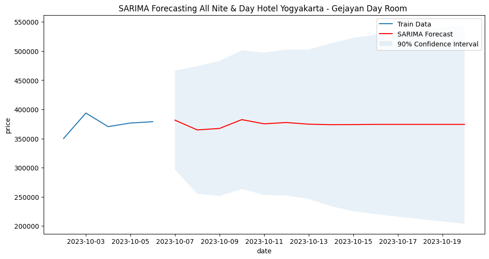

# Latar Belakang

Model Peramalan Harga ini bertujuan untuk memprediksi harga sewa kamar hotel di masa depan berdasarkan data historis harga. Model ini menggunakan algoritma Seasonal AutoRegressive Integrated Moving Average (SARIMA). SARIMA adalah metode peramalan time series yang memperhitungkan baik musiman maupun tren dalam data. model ini menggunakan fungsi `auto_arima` dari libary `pmdarima`. Fungsi ini memiliki cara kerja yang mirip seperti  `GridSearch` yang ada di library `skicit-learn`, karena mencoba berbagai set parameter p dan q (juga P dan Q untuk model musiman), memilih model yang meminimalkan AIC (atau BIC, atau kriteria informasi lain). Selain itu, auto_arima juga menggunakan uji stationeritas (seperti uji augmented Dickey-Fuller) dan seasonal (seperti uji Canova-Hansen) untuk model seasonal. Model ini akan melatih data harga harian sewa kamar hotel.Sebelum data *time series* harga dimodelkan, perlu dicek terlebih dahulu apakah ada hari yang harganya kosong atau loncat-loncat jadi rentang 2 hari, 3 hari. Misalnya data harga sewa hotel itu tanggal 1,2,3 ada namun tanggal 4 tidak ada, jadi langsung loncat ke tanggal 5. Jika terjadi hal demikian maka datanya perlu diimputasi dengan menggunakan linear interpolasi. 

# Algoritma
Berikut ini algoritma atau step by step dalam melakukan prediksi harga sewa hotel.   
1. **Inisialisasi data**  
dalam format terstruktur yang mencakup tanggal, harga, nama hotel, nama kamar, dan nama OTA (Online Travel Agency). Data disusun dalam DataFrame Pandas untuk memudahkan manipulasi.
2. **Membaca Data**  
Untuk fokus pada skenario tertentu, yaitu pemilihan data untuk hotel, kamar, dan OTA tertentu. DataFrame difilter berdasarkan kriteria yang diberikan.
3. **Imputasi data**  
Untuk menangani nilai yang hilang. Metode ini menggunakan interpolasi linear untuk mengisi nilai yang hilang. Jika terdapat rentang lebih dari 1 hari antara dua titik data, model melakukan interpolasi linear untuk mengisi nilai di antara keduanya. 
4. **Pelatihan Model**
Setelah data *time series* harga sewa kamar hotel sudah diimputasi, selanjutnya dilakukan pelatihan dengan model `SARIMAX` yang dioptimasi dengan menggunakan fungsi `auto_arima` untuk mencari parameter optimalnya secara otomatis. Kemudian  dengan menggunakan `confidence interval`, rentang nilai yang mungkin dari setiap prediksi juga ditentukan. 
    ```py
    # Find the best SARIMA model using pmdarima
    best_sarima = auto_arima(train['price'], seasonal=True, m=7, stepwise=True, trace=True)
    p, d, q = best_sarima.order
    P, D, Q, s = best_sarima.seasonal_order

    # Initialize and fit the SARIMAX model
    model = SARIMAX(train['price'], order=(p, d, q), seasonal_order=(P, D, Q, s))
    model_fit = model.fit()
    ```
    Model memilih 90 hari terakhir dari data yang telah diimputasi untuk pelatihan.
5. **Peramalan(Forecasting)**  
Model yang sudah dilatih kemudian digunakan untuk meramalkan atau forecasting harga sewa hotel kedepannya. Kita bisa memilih seberapa jauh harga di masa depan yang kita ingin meramalkan. Semakin jauh tanggal di masa depan, maka model semakin tidak akurat. Di sini kita menggunakan  default nya adalah 14 hari di masa depan. Selain itu disini kita menggunakan *Confidence interval* untuk mencari nilai tertinggi dan nilai terendah yang mungkin dari setiap prediksi. Nantinya dari situ kita bisa mengetahui rentang prediksinya.

6. **Visualisiasi hasil prediksi**
Jika diperlukan hasil diprediksi dan confidence interval akan diplotting. Yang diplotting  mencakup 5 hari terakhir data latih, peramalan SARIMA, dan area berbayang yang mewakili *confidence interval*. Visualisasi ini membantu memahami akurasi dan ketidakpastian dari prediksi harga.

### Contoh



